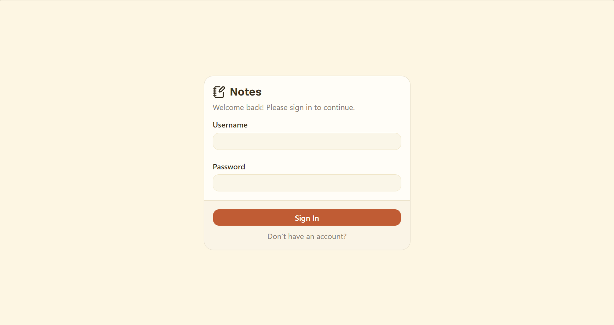
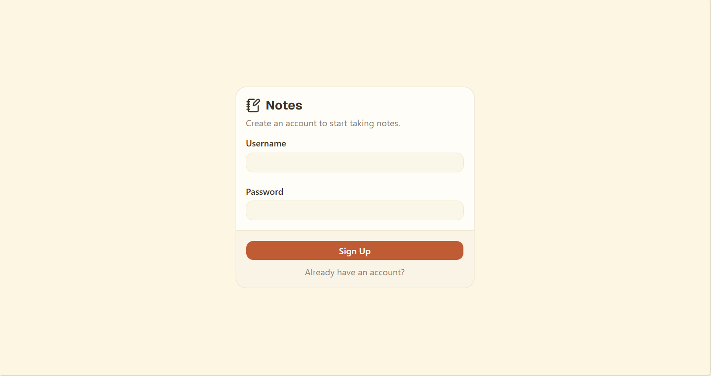
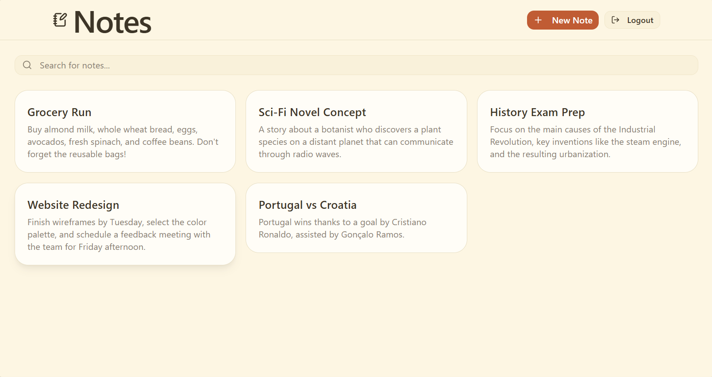
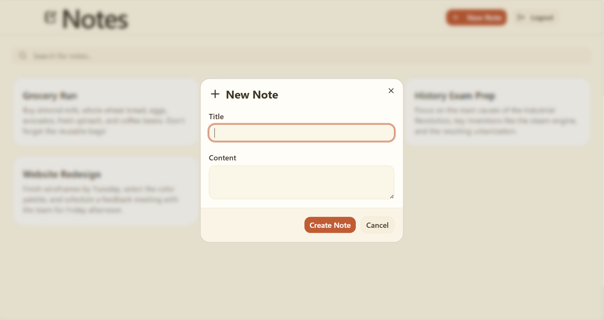
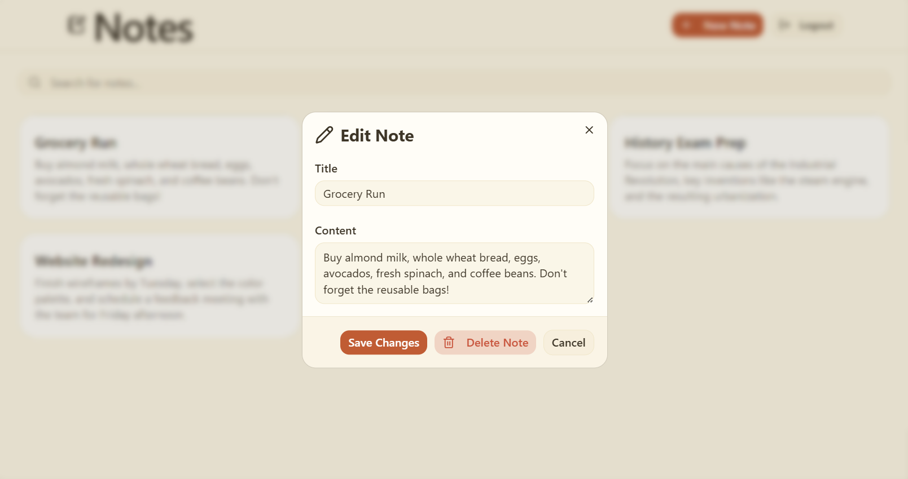

# Notes App

A simple notes application built with ASP.NET Core on the backend and React + Vite on the frontend. It allows users to register, log in, create, edit, search, and delete personal notes.

## Features

- User registration and login
- JWT-based authentication
- Create, update, and delete notes
- Search notes by title or content
- Protected routes for authenticated users

## Screenshots

### Login


### Register


### Home


### Create note


### Edit note


## Tech Stack

- Backend: ASP.NET Core, Entity Framework Core, PostgreSQL, JWT
- Frontend: React, TypeScript, Vite, Tailwind CSS, React Query

## Getting Started

### 1. Prerequisites

- .NET SDK 10+
- Node.js 20+
- Docker (optional, for database setup)

### 2. Run the database

If you are using Docker, start the database with:

```bash
docker compose up -d
```

### 3. Run the backend

```bash
cd backend/src/Notes.Api
dotnet run
```

The API will be available at:

- http://localhost:5182
- https://localhost:7215

### 4. Run the frontend

In a separate terminal:

```bash
cd frontend
npm install
npm run dev
```

Then open:

- http://localhost:5173

## Default usage

1. Create an account in the register page.
2. Sign in with your credentials.
3. Create your first note from the home page.

## Project structure

```text
backend/
  src/Notes.Api/
frontend/
  src/
```

## Notes

This project is intentionally simple and focused on demonstrating a clean vertical-slice-style structure for a small application.